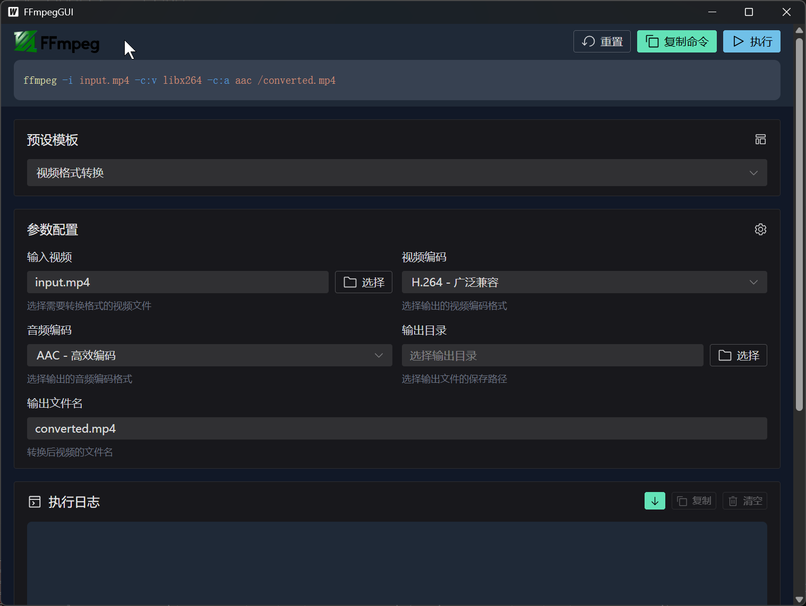
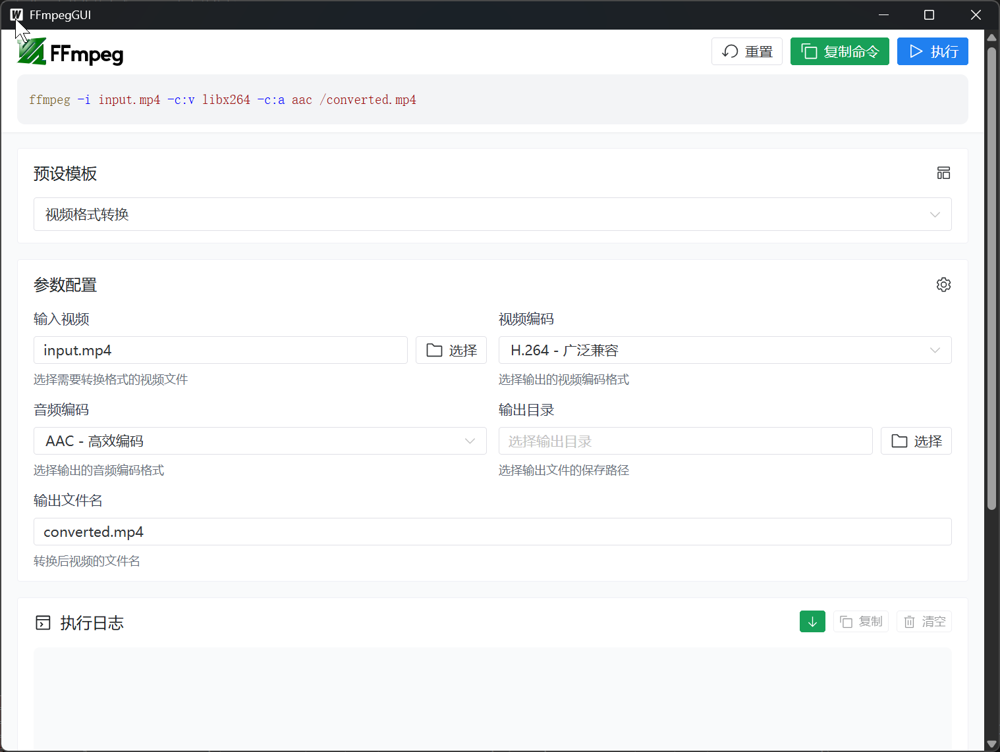

# FFmpegGUI

可视化，参数化的生成ffmpeg命令并执行




# 使用前须知

## FFmpeg安装要求

在使用本程序前，请确保您的电脑已安装FFmpeg并将其添加到系统环境变量中。

### 安装方法
1. 官方下载: [FFmpeg官网](https://ffmpeg.org/download.html)
2. Windows用户: 下载静态版本并解压，将bin目录添加到PATH环境变量
3. Linux用户: 使用`apt install ffmpeg`(Ubuntu/Debian)或`yum install ffmpeg`(CentOS/RHEL)
4. macOS用户:
   - 安装Homebrew(如未安装):
     ```bash
     /bin/bash -c "$(curl -fsSL https://raw.githubusercontent.com/Homebrew/install/HEAD/install.sh)"
     ```
   - 使用Homebrew安装FFmpeg:
     ```bash
     brew install ffmpeg
     ```

### 验证安装
在命令行中运行以下命令验证安装:
```bash
ffmpeg -version
```
如果显示版本信息则表示安装成功。

注意: 本程序仅负责生成并执行FFmpeg命令，不包含FFmpeg本身。

# 构建

## 环境要求

- go 版本要求 >= 1.24.3
- node 版本要求 >= 20

```bash
npm install -g pnpm
go install github.com/wailsapp/wails/v2/cmd/wails@latest

wails build

# ubuntu中可能需要使用
# https://github.com/wailsapp/wails/issues/4382
wails build -tags webkit2_41
```